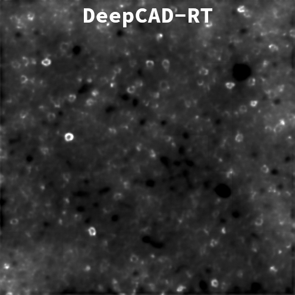

# Enhancing Denoiser Models with FFT/DCT Video Fusion
My method provide a substantial improvement over the denoiser ([*DeepCAD-RT*](https://github.com/cabooster/DeepCAD-RT) in this example) prediction. As you can see, PSNR increases by $2dB$, but the most interesting result is the improvement of SSIM2D by $0.2$ points.

  

## Test Datasets
### [Synthetic Calcium Imaging](https://zenodo.org/records/6254739)
This is the most relevant dataset in this study:
- **It is synthetic**, yet very much alike the real dataset provided by the affiliated research group.
- As such, **it has ground truths**. Therefore we can fairly assess the validity of the proposed solution.

  
  

### [Zebrafish Multiple Brain Regions](https://zenodo.org/records/6293696)

  

### [Mouse Brain Neutrophils](https://zenodo.org/records/6296569)

  

