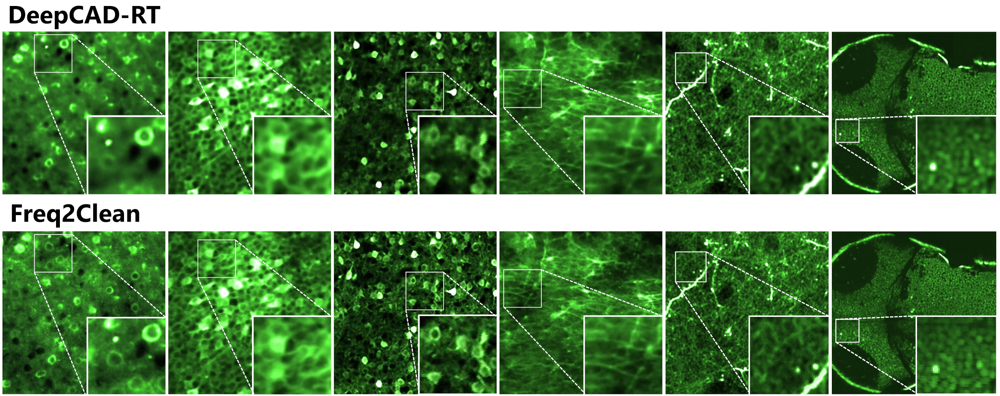
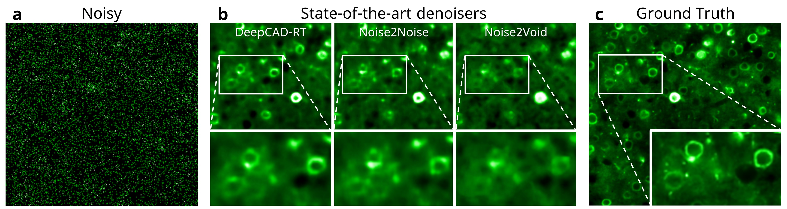
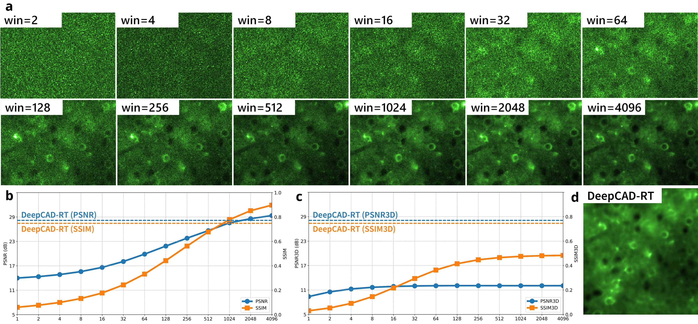
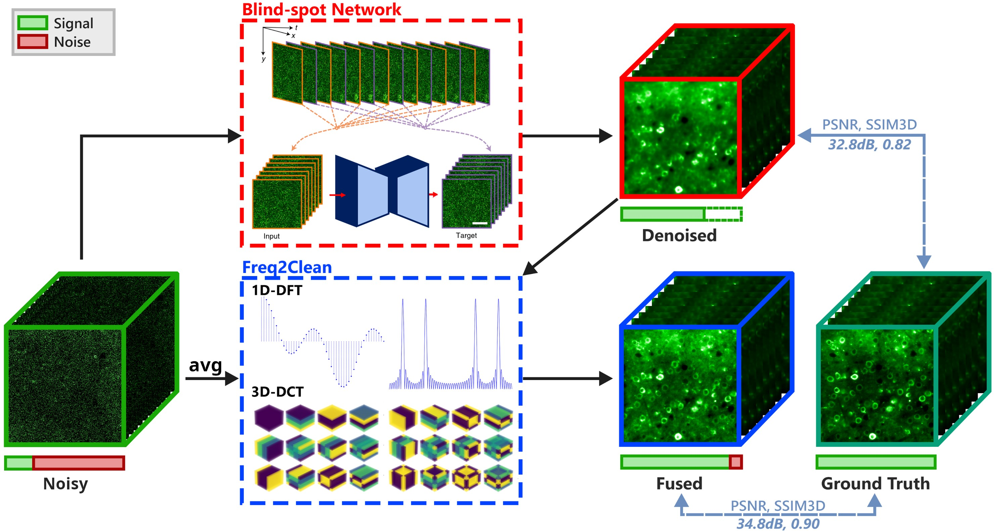
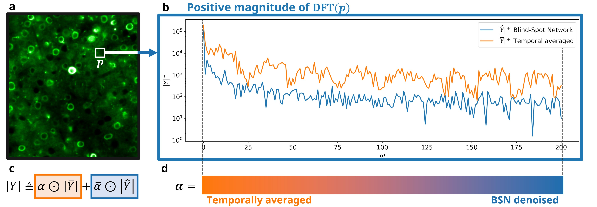
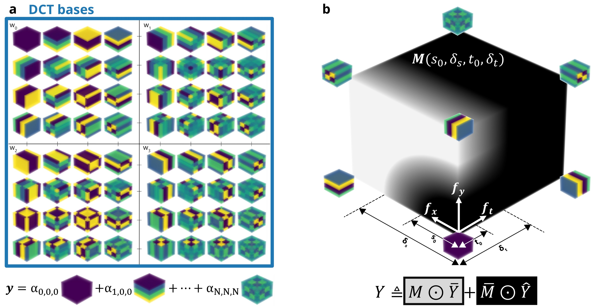
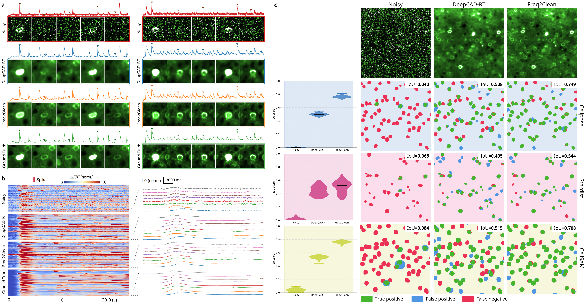

# Freq2Clean: enhancing calcium imaging denoising via frequency-domain fusion

Freq2Clean is a lightweight enhancement module trained on synthetic data that operates *after* a denoiser. In the Fourier domain, it fuses the magnitude of the *temporally averaged* video containing **high spatial SNR** with the *denoiser*'s output, containing **fast transients**.

<p align="center">
  
</p>

## 📂 Repository structure

1. [`1-eda`](1-eda) $-$ contains instructions to download datasets and visualizes them.
2. [`2-sota`](2-sota) $-$ denoise data with state-of-the-art denoisers. These denoised recordings serve as a baseline for Freq2Clean.
3. [`3-freq2clean`](3-freq2clean) $-$ implements the parameter tuning as a torch module, trains and tests it against state-of-the-art baselines.
   - [`A-frequency_fusion`](3-freq2clean/A-frequency_fusion) $-$ explores multiple frequency transforms to combine the best features of temporally averaged and denoised videos. Runs a grid search to find a good combination for the coefficients of the frequency combination.
4. [`4-segmentation`](4-segmentation) $-$ proves that Freq2Clean leads to segmentation predictions that more closely match those obtained from the ground-truth frames. Also proves that Freq2Clean doesn't affect temporal dynamics.

## 🛠️ Installation

Clone repository:

```sh
git clone https://github.com/MrPio/freq2clean
cd freq2clean
```

Create and activate environment:

```sh
conda create -n freq2clean python=3.12
conda activate freq2clean
pip install -r requirements.txt
```

## 🚀 Inference

1. Download a dataset (use notebooks in [*Section 1*](1-eda/) or add your own dataset into [`DATASETS`](src/dataset/dataset.py)).
2. Denoise the recording using any denoiser (as in [*Section 2*](2-sota/)) and place the denoised `.tif` file inside the same folder where `x.tif` and `gt.tif` are.
3. Run the inference with the following command, where:
   - `--checkpoint` is the name of the subfolder of [`trainings/`](3-freq2clean/trainings) where the checkpoint is located;
   - `--dataset` is the key of the dataset in [`DATASETS`](src/dataset/dataset.py);
   - `--denoiser` is the name of the denoised `.tif` file.

```sh
cd 3-freq2clean
python freq2clean_test.py \
  --checkpoint dft1d \
  --dataset synthetic \
  --denoiser deepcad \
  --batch_size 1
```

## 🏋️ Training

1. Edit [`train_config.json`](3-freq2clean/train_config.json):
   - `denoiser_variant`: the suffix of the denoised `.tif` file, if any. This is used to train on multiple denoised versions predicted by the same denoiser, but with different hyperparameter configurations;
   - `frequency_transform`: choose between `dft1d` and `dct3d`;
   - `patch_t`/`patch_xy`: choose the dimensions of the training patches. Use smaller `patch_t` values for `dct3d` to limit the number of parameters.
1. Run `cd 3-freq2clean; python freq2clean_train.py`.

## 💭 Assumptions

1. The input video should be severely noisy, yielding a very low input SNR. Otherwise, there is little margin for improvement with SOTA denoisers.
2. The recording should be still. The camera and the objects being recorded should both have slow spatial dynamics.

## 1. Self-supervised denoisers oversmooth fine spatial details

When operating under extremely low SNR conditions, which is common in *in-vivo* and miniature-microscope recordings, self-supervised denoisers can't capture fine details. This is **due to the limited temporal context provided during training**. This loss of spatial detail can negatively impact downstream analyses such as ROI segmentation, neuron extraction, and morphological assessment.

<p align="center">
  
</p>

## 2. Temporal averaging

Temporal averaging reduces noise variance under a Poisson–Gaussian model, commonly assumed in 2PM. However, **the spatial SNR gain comes at the cost of reduced temporal resolution** which makes it unsuitable for applications where preserving neuronal activity patterns is critical.

<p align="center">
  
</p>

## 3. Frequency-domain fusion

Freq2Clean explicitly exploits the complementarity between *temporally averaged* recordings and *denoiser* outputs through a frequency-domain formulation. In doing so, **it increases spatial SNR while preserving temporal resolution altogether, all without requiring the presence of a clean version of the noisy recording**.

<p align="center">
  
</p>

### 3.1. 1-Dimensional Discrete Fourier Transform (1D-DFT)

One DFT is computed along the temporal dimension for each pixel sequence in the video (a). Then, the magnitude spectra of the *temporally averaged* signal and the *denoised* signal (b) are fused by a convex combination of their Fourier magnitudes (c). The coefficients should favor the *temporally averaged* signal in the low-frequency band and the *denoised* signal in the high-frequency band (d).
<p align="center">
  
</p>

### 3.2. 3-Dimensional Discrete Cosine Transform (3D-DCT)

The 3D DCT expresses a volumetric video patch as a linear combination of 3D DCT basis functions (a). Accordingly, a 3D DCT is computed for both the temporal-averaged and baseline videos and fusion is then performed by taking a convex combination of the resulting DCT coefficients. These fusion coefficients form a 3D mask (b).
<p align="center">
  
</p>

### 4. Results

When comparing frames side-by-side from two sample neurons, the Freq2Clean outputs are visibly closer to the ground truth (a). Furthermore, analyzing calcium transients from 80 isolated action potentials (b) reveals that Freq2Clean preserves baseline temporal dynamics. Freq2Clean leads to segmentation predictions that more closely match those obtained from the ground-truth frames (c).
<p align="center">
  
</p>

### Table 1: Performance on the [NAOMi](https://zenodo.org/records/6254739) Synthetic Dataset

Freq2Clean consistently improves PSNR3D and SSIM3D when applied to state-of-the-art denoisers.

| Method      | *Baseline* PSNR3D ↑ | *Baseline* SSIM3D$ ↑ | *Freq2Clean* PSNR3D$ ↑ | *Freq2Clean* SSIM3D ↑ |
| ----------- | :-----------------: | :------------------: | :--------------------: | :-------------------: |
| BM3D        |        13.52        |        0.207         |       **13.74**        |       **0.280**       |
| BM4D        |        14.61        |        0.385         |       **14.79**        |       **0.486**       |
| Noise2Void  |        16.35        |        0.267         |       **17.21**        |       **0.288**       |
| Noise2Noise |        18.64        |        0.499         |       **19.13**        |       **0.594**       |
| DeepCAD-RT  |        27.94        |        0.760         |       **30.04**        |       **0.880**       |
| TeD         |        22.64        |        0.546         |       **23.22**        |       **0.597**       |

### Table 2: Performance on [Real Datasets](https://cabooster.github.io/DeepCAD-RT/Datasets/)

The enhancement provided by Freq2Clean generalizes to real datasets. Even though only pseudo-ground truths with tenfold SNR compared to the inputs are available, Freq2Clean still systematically improves PSNR3D and SSIM3D.

| Dataset                     | DeepCAD-RT PSNR3D ↑ | DeepCAD-RT SSIM3D ↑ | Freq2Clean PSNR3D ↑ | Freq2Clean SSIM3D ↑ |
| --------------------------- | :-----------------: | :-----------------: | :-----------------: | :-----------------: |
| Mouse neuronal populations  |        19.33        |        0.210        |      **19.52**      |      **0.244**      |
| Zebrafish brain             |        16.84        |        0.259        |      **16.87**      |      **0.289**      |
| Mouse dend. spines (50 mW)  |        13.38        |        0.090        |      **13.46**      |      **0.092**      |
| Mouse dend. spines (115 mW) |        13.40        |        0.149        |      **13.43**      |      **0.155**      |

### Supplementary materials

- 📘 Thesis - *Freq2Clean: enhancing calcium imaging denoising via frequency-domain video fusion* [`.PDF`](assets/Freq2Clean_enhancing_calcium_imaging_denoising_via_frequency_domain_video_fusion%20-%20Valerio%20Morelli%20PDFA1b.pdf)

- 📙 Slideshow - *Graduation slideshow* [`.PPTX`](assets/Slideshow%20-%20Valerio%20Morelli.pdf)

- 📽️ Demo - *Demo Video* [`.MP4`](assets/Freq2Clean%20vs%20DeepCAD.mp4)

- 📽️ Other recordings - *recordings* [`Folder`](renderings/)
