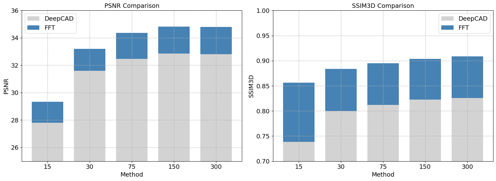
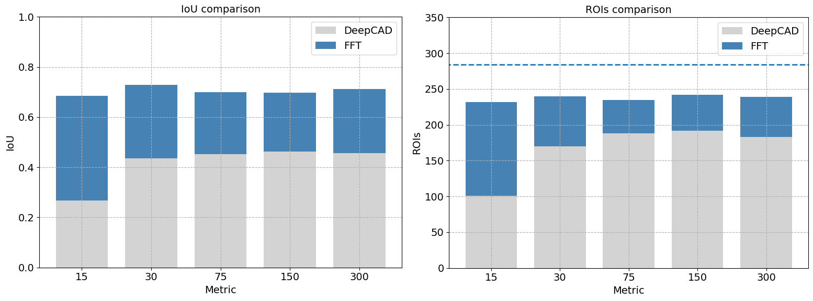
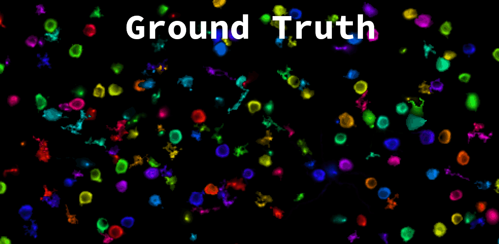

# Enhancing Denoiser Models with FFT/DCT Video Fusion
My method provides a substantial improvement over the denoiser ([*DeepCAD-RT*](https://github.com/cabooster/DeepCAD-RT) in this example) prediction. As you can see, PSNR increases by $2dB$, but the most interesting result is the improvement of SSIM3D by $0.1$ points.

  

The x-axis refers to the value used for the `patch_t` hyperparameter during training. `patch_t` indicates the size of frames considered in each training sample. This value is directly proportional to the training time.

As shown in the figure above, **FFT video fusion post-processing enables a value of `patch_t = 30` to outscore predictions made with `patch_t = 300` (which requires $5\times$ more training time) in terms of both PSNR and SSIM3D.**

## 📦 TL;DR
_Freq2Clean_ is a simple, yet effective post-processing technique that recovers high-frequency spatial details by leveraging the low-frequency temporal dynamics of still recordings. To do so, it performs a video fusion in the frequency domain. The results show that it significantly improves the PSNR and SSIM3D metrics on labeled synthetic datasets.

## Hyphotesis
Two hypotheses are made:
1. The input video should be severely noisy, yielding a very low input SNR. Otherwise, there is little margin for improvement with SOTA denoisers.
2. The recording should be still. The camera and the objects being recorded should both have slow spatial dynamics. The most precious information in the recording is the temporal dynamics.

## Synthetic Datasets
### [Synthetic Calcium Imaging](https://zenodo.org/records/6254739)
This is the most relevant dataset in this study:
- **It is synthetic**, yet very much alike the real dataset provided by the affiliated research group.
- As such, **it has ground truths**. Therefore, we can assess the validity of the proposed solution by computing PSNR and SSIM3D, as shown above.

  
  

## Real Datasets
### [Zebrafish Multiple Brain Regions](https://zenodo.org/records/6293696)
A very slight improvement is measured with this dataset. Since the input recording does not have such a low SNR, DeepCAD-RT already converges on a very good solution.

  
  

### [Mouse Brain Neutrophils](https://zenodo.org/records/6296569)
This recording has slowly moving cells, which violates the hypothesis of this method. Nevertheless, SSIM3D increases by approximately $0.12$, while PSNR remains unchanged.

  
  

### Unlabeled datasets
This dataset lacks any kind of ground truth.

#### Mouse Astrocyte

  

#### Mouse Neuron with GRIN lenses

  

## ROI detection 

### [*Cellpose*](https://github.com/MouseLand/cellpose)
An huge improvement is registered when segmenting with *Cellpose*. Results have been computed by averaging segmentation predictions over 50 sparse frames.

  
  

### [*Suite2p*](https://github.com/MouseLand/suite2p)
An improvement is registered when segmenting with *Suite2p*.

  
  
  

## The FFT-Fusion algorithm
My method is designed to enhance the performance of an upstream denoiser. As such, it is a post-processing activity that uses *look-ahead* to recover long-range temporal information. However, due to its simplicity, it is only effective in still recordings. For this enhancement to work, both the camera and the objects need to be still. The faster the spatial dynamics, the shorter the temporal window should be.

### Algorithm optimization
In my initial implementation, I used the functions `np.fft.fft` and `np.fft.ifft` to translate between the temporal and frequency domains. For a $6{,}000\times 512 \times 512$ video, this took about **200 seconds**

Then, since the angles are left untouched, I moved to `np.fft.rfft` and `np.fft.irfft`, improving time cost to **48 seconds**.

Finally, by leveraging the GPU and moving from *NumPy* to *CuPy*, I achieved a processing time of **16 seconds**.
