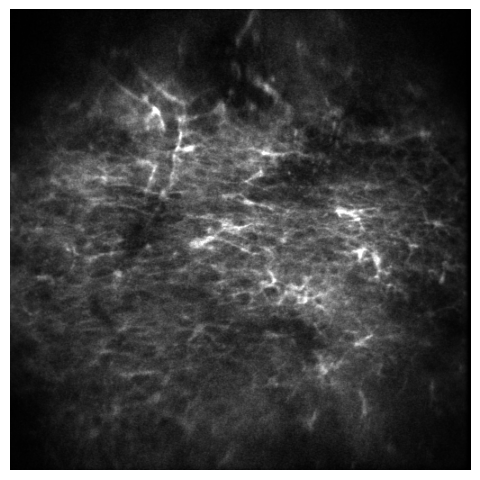
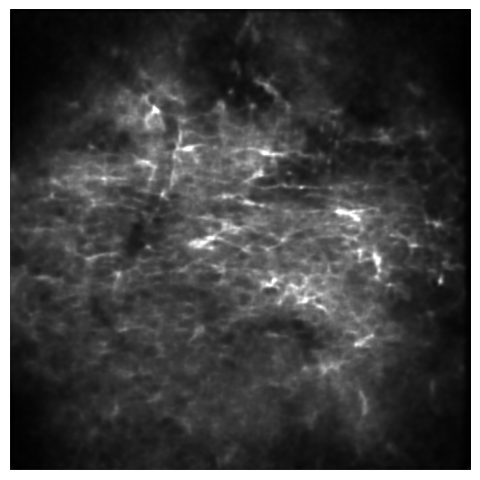
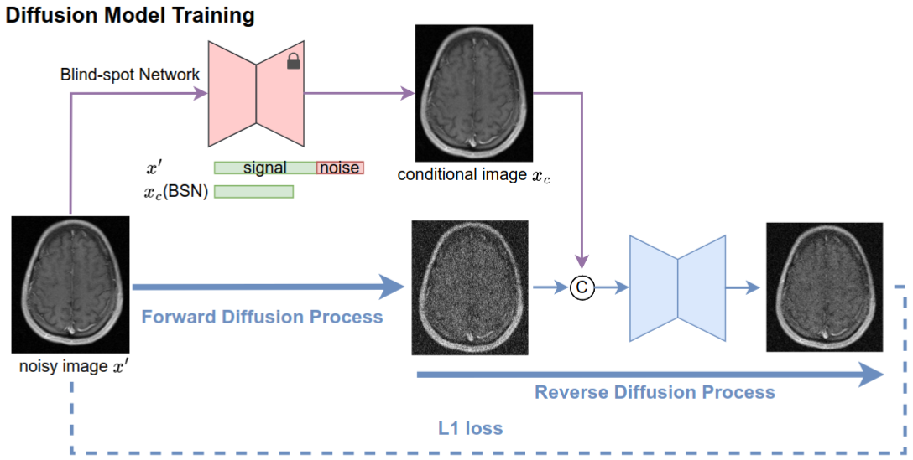
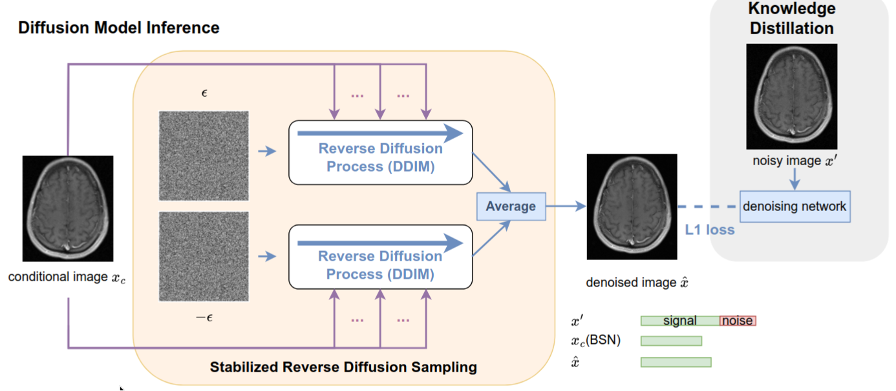
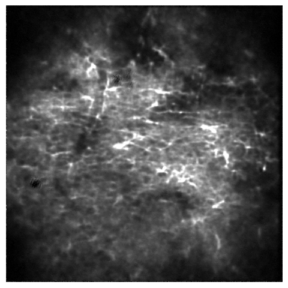

# DeepCAD-RT Prediction Improvement Via Pixel-Space Diffusion Model (1st experiment)
The aim of this experiment is to improve the clean predictions of DeepCAD-RT. While they are good, when compared with frames averaged with a sliding window, *the lack of fine detail is noticeable*.

    </img>
    </img>

Our approach is inspired by DiffDenoise [1]. The DeepCAD-RT prediction, $x_c$, is the conditioning image. This is concatenated, channel-wise, with the noisy measurement, $x_0$, after the diffusion process ($x_T$).

</img>

During inference, we replace the *DDPM* scheduler with the *DDIM* scheduler to reduce the number of reverse diffusion steps. Also we adopt the *Stabilized Reverse Diffusion* sub-sampling technique devised by the authors.

</img>

The (unsatisfactory) result is the following.

</img>

[1] Demir et al., "DiffDenoise: Self-Supervised Medical Image Denoising with Conditional Diffusion Models"